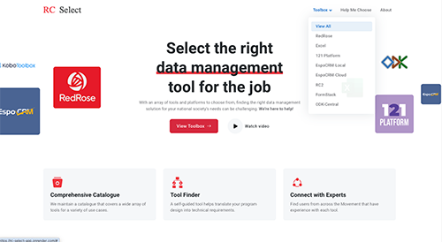
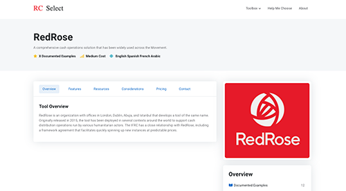
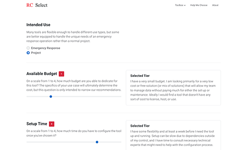
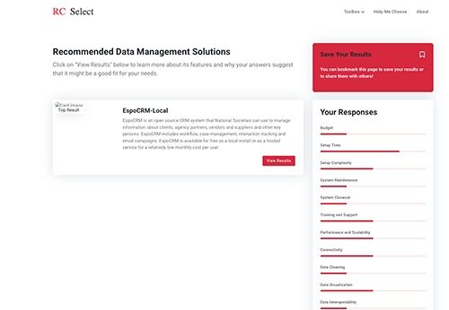
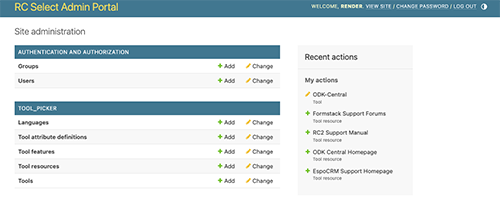
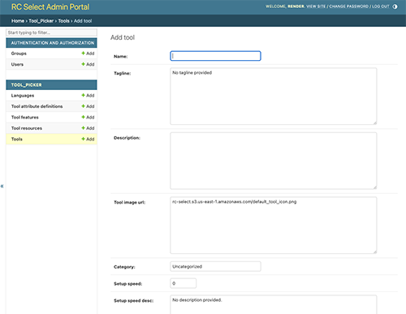
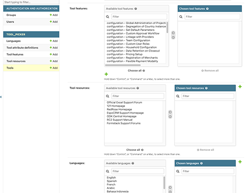
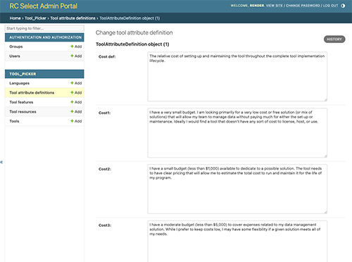

# RC-Select Documentation

## Table of Contents
- [Overview](#overview)
- [Finding the Right Tool](#finding-the-right-tool)
- [Accessing the Adminsitrative Interface](#accessing-the-administrative-interface)
- [Adding a New Tool](#adding-a-new-tool)
- [Modifying Tool Selection Criteria](#modifying-tool-selection-criteria)
- [Glossary](#glossary)

## Overview
RC-Select is a django-based web application developed by Jonathan Garro with the American Red Cross to help teams understand the various data management tools that can be used in disaster assessment and response. RC-Select allows users to view information about various data management tools and their capabilities. RC-Select also provides a guided selection process that will recommend tools based on user-supplied characteristics about their project, budget, technical skills and data needs.


## Finding the Right Tool
RC-Select allows users to browse and learn about data collection and management tools. To see the tools available, click **Toolbox** on the home page.



To find out more inforamtion about a particular tool, select it in the **Toolbox** dropdown. More detailed information about the tool will be provided.



RC-Select also includes a **Help Me Choose** feature that allows users to describe their project, budget, setup time, data needs and other characteristics. RC-Select will then recommend a tool based on the criteria specified.



Once the user makes their selections, RC-Select will recommend a tool based on the criteria supplied and the weighting factors configured. 



## Accessing the Administrative Interface
RC Select uses the [Django Framework](https://www.djangoproject.com/) for Python, and leverages the built-in administrative interface for adding, modifying or deleting records in the backend database. A [high-level ERD](rc_select_erd.pdf) describes the tables and data structures used by the application.

To access the administrative interface, an administrative user must first be created. In order to create the first administrative user, run the following command at the root of the project directory:

```
python manage.py createsuperuser
```

This will prompt you to set a username and password for the initial administrative user. Subsequent users can be added through the administrative web interface, which will be available at [http://127.0.0.1:8000/admin/](http://127.0.0.1:8000/admin/) if the app is deployed locally. The administrative interface is also linked from the footer of the RC-Select homepage.



This interface will allow you to add or remove administrative users, and view and modify database records for the various object types in the database. 

## Adding a New Tool
In order to add a new tool to RC-Select, it's useful to have all of the child records in place before adding the tool itself. The most common example of this will be adding resources for the tool, so that you can incorporate links to vendor support or documentation.

It is also possible to add tool features and languages through this interface, but that will likely be less common.

Once you have added any new resource, feature or language records, you can add the tool itself. There are a number of fields collected, so it's a good idea to review the data needed and prepare it in advance.



It's important to note that the values used for the various selection criteria will drive the **Help Me Choose** function in determining when to recommend a tool. The selection criteria currently include the following values:
- Setup speed
- Setup complexity
- Maintenance complexity
- Training and support
- Transition
- Performance
- Connectivity
- Data cleaning
- Data visualization
- Data management policies
- Interoperability
- Localization
- Data privacy
- Data Protection
- Cost

After this information has been added, you will have the opportunity to link features, resources, and languages to the tool that you are adding.




## Modifying Tool Selection Criteria

Tool selection is driven by the values of the individual selection criteria on each tool, and their relationship to the criteria used in the **Help Me Choose** form. The criteria used by **Help Me Choose** is stored in the `ToolAttributeDefinition` object, which defines the criteria for each option.



If you wish to change how an individual tool scores, modify the weights on the tool record itself. If you want to change the overall categories by which all tools are evaluated, you would need to modify the `ToolAttributeDefinition` object and then incorporate values for the new criteria into each tool's record.